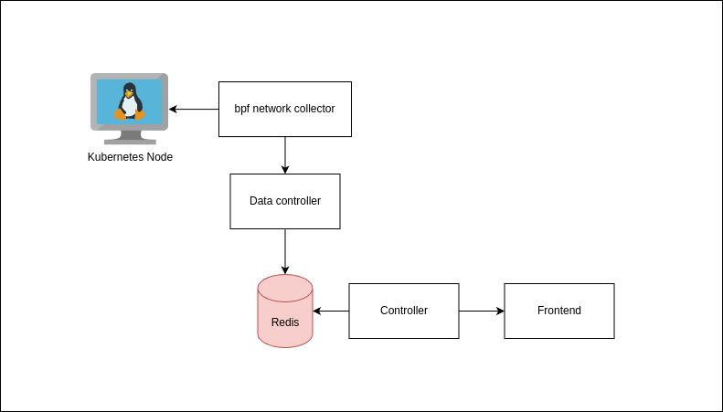

## This project provides a graphical interface that shows real time HTTP requests from containers in Kubernetes.

It is composed by:
- Frontend (Reactjs)
  - Render nodes to visualize the containers network traffic
- Backend (golang)
  - API for the frontend
- Backend data controller (golang)
  - Receives the network data from python using GRPC
- Backend python eBPF
  - Uses BCC library to attach eBPF code to get information from the network

## Diagram

## DEMO
<video src='demo.mp4'></video>